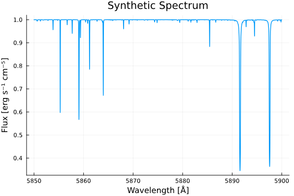

**Course:** Modern Astrophysics
 
**Description:**
As part of my Astrophysics major, this course covered the life cycle of stars, the physical and chemical evolution of galaxies and their nuclei, stellar spectra and more. A component of this course was using real and simulated data to understand physical processes like spectra of stars and mass loss rates of galaxies. This was done through the occasional coding problems ingrained within theoretical problems in homework sets.

Disclaimer: I am putting these here retroactively to showcase the sort of work I’ve done; however, I make significant changes to problems, wording, and remove searchable names so as to not explicitly give solutions to students who may take this course or similar courses in the future.

**Problem Set #1:**
- As part of this problem set, we install the spectrum synthesis program **Korg**. At the time, we used Julia coding language to work with the example. Documentation can be found here: https://github.com/ajwheeler/Korg.jl/tree/main 
- We make an example of a synthetic stellar spectrum with an effective temperature, surface gravity and metallicity, then we create a second spectrum, but at a different effective temperature and do some analysis.

**Problem Set #3**
- As part of this problem set, we use data from Download DARWIN stellar models from: https://cdsarc.cds.unistra.fr/ftp/J/A+A/626/A100/mgridsol.dat 
- With the accompanied readme that details the column names: https://cdsarc.cds.unistra.fr/ftp/J/A+A/626/A100/ReadMe 
- And use equations detailed here: arxiv.org/pdf/1805.05164.pdf 
- We simulate mass loss rates for stars using Reimers formula and the Van Loon equation and comparing them to simulated mass losses from DARWIN.

